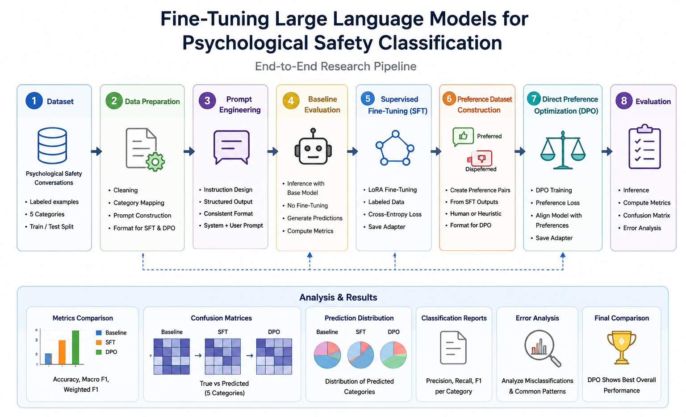
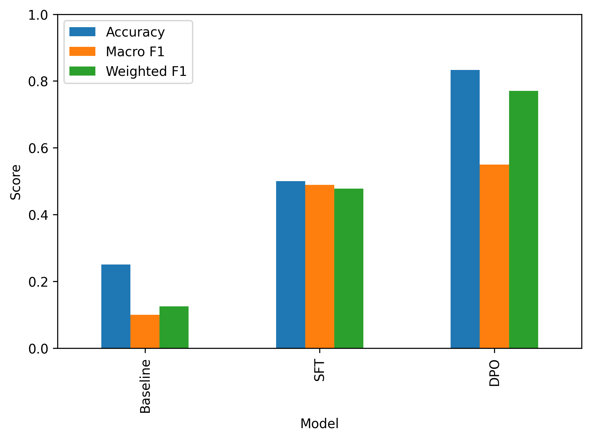
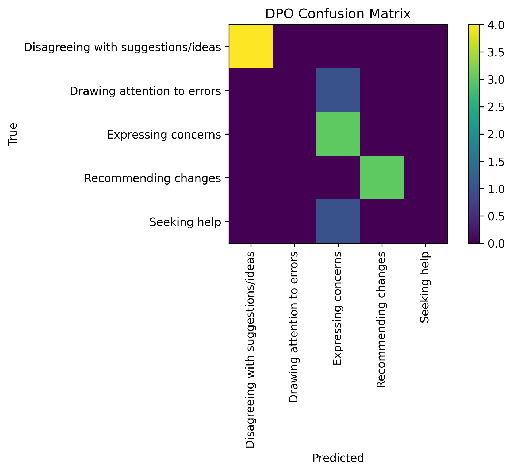
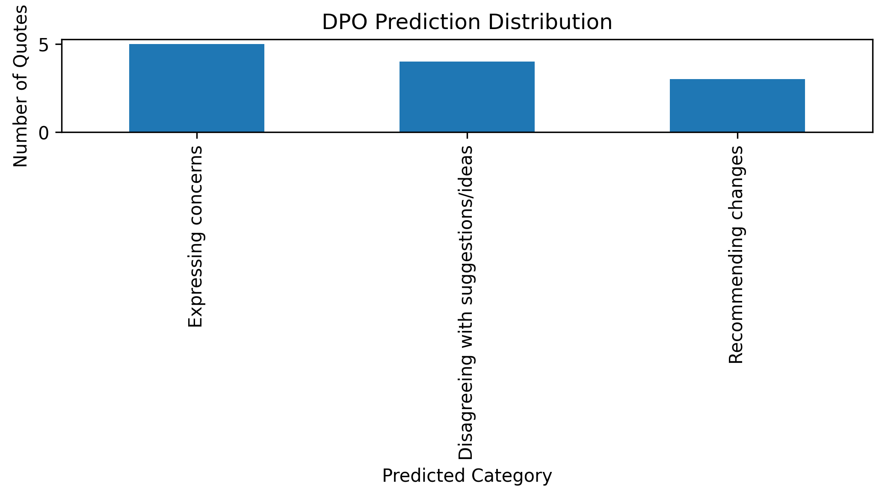

# Fine-Tuning-PS-LLM: LLM Alignment for Psychological Safety Classification

<p align="center">
  
</p>

<p align="center">
  
  
  
  
  
  
  
  
</p>

---

## Highlights

```
✓ End-to-end LLM fine-tuning pipeline       ✓ SFT using PEFT/LoRA
✓ DPO with TRL                               ✓ Automated evaluation
✓ Reproducible experiments                   ✓ Research-oriented implementation
✓ 3.3× accuracy gain vs. zero-shot          ✓ Domain-specific qualitative coding
```

> **Note**
> This repository is an open-source research implementation that demonstrates my approach to LLM fine-tuning, preference optimization, and evaluation pipelines.
> Some of my research collaborations and applied AI projects involve proprietary datasets or confidential code under research or institutional agreements. Therefore, only work that can be publicly shared is included here.

---

## Overview

This repository presents a complete, end-to-end research pipeline for adapting a large language model (LLM) to the specialized task of **Psychological Safety (PS) classification** in software engineering team discussions.

The project investigates whether progressive alignment strategies — specifically **Supervised Fine-Tuning (SFT)** followed by **Direct Preference Optimization (DPO)** — can systematically improve classification performance beyond zero-shot baseline inference on a domain-specific qualitative coding task.

The experimental design is grounded in a published paper presented at **EASE 2026**, which established the gold-standard annotation scheme and dataset used throughout this project. This repository operationalizes that prior work by examining whether fine-tuning a compact open-source model can replicate or surpass the classification behavior elicited through prompt engineering with larger proprietary models.

---

## Key Contributions

- **End-to-end SFT pipeline** — Instruction-tuned LoRA adaptation from raw annotations to evaluated adapter
- **Preference dataset construction** — Systematic `(chosen, rejected)` pair generation grounded in actual SFT failure modes
- **DPO alignment** — Preference-based optimization without a reward model, using TRL `DPOTrainer`
- **Complete evaluation framework** — Accuracy, Macro F1, Weighted F1, Cohen's κ, confusion matrices, and prediction distribution analysis
- **Open-source reproducible implementation** — All notebooks, data splits, adapter weights, and figures are publicly available

---

## Research Impact

This repository presents a reproducible applied research workflow for adapting compact open-source LLMs to domain-specific qualitative coding tasks. The progressive alignment strategy (SFT → DPO) achieves a **3.3× accuracy improvement over the zero-shot baseline** (compared within the same model and task setting), offering a reproducible blueprint for similar low-resource NLP classification problems in software engineering research. The repository is intended as a reproducible research artifact rather than a production-ready system.

---

## Motivation

Psychological Safety — the shared belief that a team environment is safe for interpersonal risk-taking — is a foundational construct in organizational behavior research and has been increasingly recognized as a critical factor in software team performance, agile process effectiveness, and developer well-being.

Automating the classification of Psychological Safety challenges from developer discussions has broad applications in:

- **Human-centered Software Engineering** — understanding barriers to open communication in development teams
- **Agile process analytics** — detecting friction in retrospectives, sprint reviews, and standups
- **Organizational behavior research** — scaling qualitative analysis across large corpora of developer discussions
- **AI-assisted team coaching** — supporting Scrum Masters and engineering managers with real-time insight

This project directly addresses the question:

> *Can domain-specific fine-tuning of a compact open-source LLM, augmented with preference-based alignment, outperform prompt engineering alone for qualitative coding of Psychological Safety challenges?*

---

## Research Pipeline

```
┌─────────────────────┐
│  1. Dataset         │  Gold-standard annotations from EASE 2026 paper
│     Preparation     │  116 developer quotes · 7 PS categories
└────────┬────────────┘
         │
┌────────▼────────────┐
│  2. Prompt          │  Structured instruction prompt (P01)
│     Engineering     │  Few-shot examples · JSON output format
└────────┬────────────┘
         │
┌────────▼────────────┐
│  3. Baseline        │  Zero-shot evaluation on Qwen2.5-1.5B-Instruct
│     Evaluation      │  No task-specific adaptation
└────────┬────────────┘
         │
┌────────▼────────────┐
│  4. Supervised      │  LoRA fine-tuning · PEFT · Instruction format
│     Fine-Tuning     │  SFT checkpoints · Adapter weights
└────────┬────────────┘
         │
┌────────▼────────────┐
│  5. Preference      │  Constructed from SFT errors · Chosen/Rejected pairs
│     Dataset         │  52 preference pairs · Category-level disambiguation
└────────┬────────────┘
         │
┌────────▼────────────┐
│  6. Direct Pref.    │  TRL-based DPO training on SFT adapter
│     Optimization    │  Preference-based alignment without RL reward model
└────────┬────────────┘
         │
┌────────▼────────────┐
│  7. Evaluation      │  Accuracy · Macro F1 · Weighted F1 · Confusion Matrix
│     & Analysis      │  Error analysis · Prediction distribution comparison
└─────────────────────┘
```

---

## Methodology

### Stage 1 — Baseline (Zero-Shot Inference)

The original `Qwen2.5-1.5B-Instruct` model is evaluated without any task-specific adaptation. The structured prompt developed in the EASE 2026 paper (P01) is applied directly to elicit structured JSON classification outputs. This establishes the performance floor against which fine-tuned variants are compared.

### Stage 2 — Supervised Fine-Tuning (SFT)

The model is fine-tuned using labeled Psychological Safety examples formatted as instruction–response pairs. Training employs **LoRA (Low-Rank Adaptation)** via the **PEFT** library on a **QLoRA** setup to enable efficient adaptation within Google Colab GPU constraints. The SFT adapter is saved separately from the base model weights, enabling modular evaluation.

Key configuration:
- **Base model:** `Qwen/Qwen2.5-1.5B-Instruct`
- **Adaptation method:** LoRA (rank 8, alpha 16)
- **Training framework:** Hugging Face `transformers` + `trl` SFT Trainer
- **Optimizer:** AdamW with cosine LR schedule

### Stage 3 — Direct Preference Optimization (DPO)

Preference pairs are constructed systematically from SFT model errors: cases where the SFT model misclassified a quote are used to generate `(chosen, rejected)` pairs where `chosen` is the gold-standard category and `rejected` is the model's incorrect prediction. This approach grounds preference data in actual model failure modes rather than arbitrary human intuitions.

The DPO training step uses the **TRL `DPOTrainer`**, initializing from the SFT adapter, and optimizes the model to assign higher likelihood to correct classifications over confusable alternatives — particularly relevant given the known inter-category ambiguity between *Expressing Concerns*, *Sharing Negative Feedback*, and *Drawing Attention to Errors* identified in the original paper.

---

## Dataset

| Property | Value |
|---|---|
| Source | Stack Overflow / developer community discussions (curated) |
| Annotation scheme | Published in EASE 2026 |
| Categories | 7 Psychological Safety challenge types |
| Total quotes | 116 |
| Train / Dev / Test split | 80 / 10 / 10 |
| Preference pairs (DPO) | 52 |
| Annotation basis | Expert qualitative coding (Human-in-the-Middle paradigm) |

**Psychological Safety Categories:**

| Category | Description |
|---|---|
| Expressing concerns | General emotional frustration or worry without identifying specific errors |
| Recommending changes | Proposing modifications to development practices or processes |
| Sharing negative feedback | Constructive criticism of specific behaviors or practices |
| Disagreeing with suggestions/ideas | Challenging proposals made by leaders or teammates |
| Drawing attention to errors | Highlighting concrete, verifiable mistakes or omissions |
| Seeking help | Hesitation to ask for assistance due to fear of judgment |
| Admitting mistakes | Acknowledging one's own technical or communicative errors |

---

## Results

### Metrics Comparison

<p align="center">
  
</p>

| Model | Accuracy | Macro F1 | Weighted F1 |
|---|---|---|---|
| Baseline (Zero-Shot) | 0.25 | 0.10 | 0.13 |
| SFT (LoRA) | 0.50 | 0.49 | 0.48 |
| **DPO (SFT + Preference)** | **0.83** | **0.55** | **0.77** |

> All comparisons are made within the same model (`Qwen2.5-1.5B-Instruct`) and task setting. DPO achieves a **3.3× improvement in accuracy** and a **5.5× improvement in Macro F1** compared with the zero-shot baseline, demonstrating that progressive alignment significantly narrows the gap between an instruction-tuned compact model and the classification quality achievable through expert prompt engineering with larger proprietary models.

### Confusion Matrices

<p align="center">
  
</p>

### Prediction Distribution

<p align="center">
  
</p>

The prediction distribution analysis reveals a critical behavioral shift across training stages: the baseline model collapses almost entirely onto *Expressing Concerns*, reflecting a severe label bias common in zero-shot inference on imbalanced qualitative coding tasks. SFT partially corrects this tendency. DPO further recalibrates prediction diversity, enabling the model to distinguish among previously confusable categories such as *Disagreeing with Suggestions/Ideas* and *Recommending Changes*.

---

## Limitations

This study has several limitations that should be considered when interpreting the results:

- **Small dataset** — The evaluation set consists of only 12 quotes (10% of 116 total), which limits the statistical reliability of reported metrics. Results should be interpreted as indicative rather than definitive.
- **Domain-specific** — The dataset and annotation scheme are specific to software engineering communities. Generalization to other domains (e.g., healthcare, education) has not been validated.
- **Single base model** — All experiments use `Qwen2.5-1.5B-Instruct` only. Performance may differ substantially with larger or differently pre-trained models.
- **Single experimental run** — No confidence intervals or statistical significance tests are reported. Multi-run evaluation with variance analysis is listed as a future direction.
- **DPO preference construction** — Preference pairs are derived from SFT errors rather than human preference judgments, which may introduce systematic biases aligned with SFT failure modes.

---

## Repository Structure

```
Fine-Tuning-PS-LLM/
│
├── README.md
├── .gitignore
├── requirements.txt
├── LICENSE
│
├── data/
│   ├── raw/                          # Original annotated dataset
│   ├── processed/                    # Cleaned and formatted data
│   ├── splits/                       # Train / dev / test CSV files
│   └── dpo/                          # DPO preference pairs (JSONL)
│
├── figures/                          # All evaluation figures (publication quality)
│   ├── Fine-Tuning-PS-LLM_Pipeline.png
│   ├── Progressive_alignment_pipeline_diagram.png
│   ├── DPO_preference_data_creation_flowchart.png
│   ├── Progressive_alignment_performance_comparison.png
│   ├── metrics_comparison.png
│   ├── baseline_confusion_matrix.png
│   ├── sft_confusion_matrix.png
│   ├── dpo_confusion_matrix.png
│   ├── baseline_prediction_distribution.png
│   ├── sft_prediction_distribution.png
│   └── dpo_prediction_distribution.png
│
├── models/
│   ├── sft_qwen/                     # SFT LoRA adapter weights
│   │   ├── adapter_config.json
│   │   ├── adapter_model.safetensors
│   │   ├── tokenizer.json
│   │   ├── tokenizer_config.json
│   │   └── training_args.bin
│   └── dpo_qwen/                     # DPO LoRA adapter weights
│       ├── adapter_config.json
│       ├── adapter_model.safetensors
│       ├── chat_template.jinja
│       ├── tokenizer.json
│       ├── tokenizer_config.json
│       └── training_args.bin
│
├── notebooks/
│   ├── environment.ipynb_00          # Environment setup and dependency check
│   ├── Baseline.ipynb_01             # Zero-shot baseline evaluation
│   ├── sft.ipynb_02                  # Supervised Fine-Tuning (SFT + LoRA)
│   ├── evaluate.ipynb_03             # Model evaluation pipeline
│   ├── generate_preferences.ipynb_04 # DPO preference dataset construction
│   ├── dpo.ipynb_05                  # Direct Preference Optimization training
│   ├── dpo_evaluate.ipynb_06         # DPO model evaluation
│   └── results_analysis.ipynb_07     # Results analysis and visualization
│
├── report/                           # Technical report (ACM format)
│   └── Fine-Tuning-PS-LLM_Technical_Report.pdf
│   
│   │
├── outputs/                          # Intermediate outputs
│
├── prompts/
│   ├── P01_Zero_Shot_Closed_Coding.txt   # Zero-shot structured prompt
│   └── P02_Multi_Shot_Closed_Coding.txt  # Few-shot structured prompt
│
├── results/
│   ├── baseline/
│   │   └── baseline_predictions.csv
│   ├── sft/
│   │   └── sft_predictions.csv
│   ├── dpo/
│   │   └── dpo_predictions.csv
│   ├── metrics_summary.csv
│   ├── comparison.csv
│   ├── errors.csv
│   └── classification_reports.csv
│
└── utils/
    ├── __init__.py
    ├── dataset.py       # Data loading and preprocessing utilities
    ├── inference.py     # Prediction and response parsing utilities
    └── metrics.py       # Evaluation metrics computation
```

---

## Experimental Setup

| Component | Configuration |
|---|---|
| Base Model | `Qwen/Qwen2.5-1.5B-Instruct` |
| Adaptation (SFT) | LoRA — rank 8, alpha 16, dropout 0.05 |
| Adaptation (DPO) | Initialized from SFT adapter |
| Training Framework | Hugging Face `transformers` 5.x |
| Preference Optimization | TRL `DPOTrainer` |
| Parameter-Efficient Tuning | PEFT 0.19+ |
| Precision | float16 (GPU inference) |
| Hardware | Google Colab (T4/A100 GPU) |
| Evaluation Metrics | Accuracy, Macro F1, Weighted F1, Cohen's κ |
| Output Format | Structured JSON (instruction-tuned prompt) |
| Random Seed | 42 |

---

## Reproducibility

To reproduce the complete experimental pipeline:

```bash
# 1. Clone the repository
git clone https://github.com/<your-username>/Fine-Tuning-PS-LLM.git
cd Fine-Tuning-PS-LLM

# 2. Install dependencies
pip install -r requirements.txt

# 3. Run notebooks in order
# 01_data_preparation.ipynb   → Prepare and split the dataset
# 02_sft_train.ipynb          → Train the SFT adapter
# 03_evaluate.ipynb           → Evaluate Baseline / SFT / DPO
# 05_dpo_train.ipynb          → Train the DPO adapter
# 07_results_analysis.ipynb   → Generate all figures and summary tables
```

> All notebooks are self-contained and designed to run on Google Colab with a free or Pro GPU runtime. Adapters are saved to Google Drive and reloaded across sessions without retraining.

---

## Technical Report

A detailed technical report describing the full methodology, experimental setup, per-class analysis, and error analysis is available in:

📄 **[`report/Fine-Tuning-PS-LLM_Technical_Report.pdf`](report/Fine-Tuning-PS-LLM_Technical_Report.pdf)**

The report is formatted in ACM style and covers:

- Research motivation and research question
- Dataset description and annotation scheme
- SFT and DPO training methodology (with DPO loss formulation)
- Complete results: accuracy, Macro F1, Weighted F1, per-class breakdown
- Confusion matrices and prediction distribution analysis
- Per-quote error trajectory across all three stages
- Limitations and future directions

> The report source (`.tex` + `.bib`) is available in [`report/`](report/) for full reproducibility.

---

## Connection to Published Research

This project builds upon the following published paper, which provides the gold-standard dataset, annotation scheme, and prompt engineering methodology (P01) used throughout this repository:

> Moaath Alshaikh, Tasneem Alshaher, Ricardo Vieira, Beatriz Santana, Clelio Xavier, José Amancio, Glauco Carneiro, Julio Leite, Sávio Freire, Manoel Mendonça.
> *Prompt Engineering Strategies for LLM-based Qualitative Coding of Psychological Safety in Software Engineering Communities: A Controlled Empirical Study.*
> **EASE 2026** — International Conference on Evaluation and Assessment in Software Engineering.
> DOI: [10.1145/3816483.3818229](https://doi.org/10.1145/3816483.3818229) · Pre-print: [arXiv:2605.07422](http://arxiv.org/abs/2605.07422)

The EASE 2026 paper established the annotation scheme, gold-standard dataset, and prompt engineering methodology that serve as the foundation for the fine-tuning experiments in this repository. This project investigates whether the performance ceiling identified in that work can be raised through supervised adaptation and preference-based alignment of a compact open-source model.

---

## Future Directions

- Evaluation on larger instruction-tuned models (Qwen2.5-7B, LLaMA-3-8B)
- Multi-run evaluation with confidence intervals and statistical significance testing
- Human-in-the-Middle (HITM) evaluation incorporating human override conditions
- Cross-domain generalization to other qualitative coding schemes in software engineering
- Reinforcement Learning from Human Feedback (RLHF) as an alternative to DPO
- Retrieval-Augmented Generation (RAG) for example-grounded classification

---

## References

This project builds directly on the following foundational works. References are limited to methods and tools actively used in this implementation.

**Primary publication**

- Alshaikh et al. (2026). *Prompt Engineering Strategies for LLM-based Qualitative Coding of Psychological Safety in Software Engineering Communities: A Controlled Empirical Study.* EASE 2026. DOI: [10.1145/3816483.3818229](https://doi.org/10.1145/3816483.3818229) · [arXiv:2605.07422](http://arxiv.org/abs/2605.07422)

**Fine-tuning & alignment methods**

- Hu et al. (2022). *LoRA: Low-Rank Adaptation of Large Language Models.* ICLR 2022. [arXiv:2106.09685](https://arxiv.org/abs/2106.09685)
- Dettmers et al. (2023). *QLoRA: Efficient Finetuning of Quantized LLMs.* NeurIPS 2023. [arXiv:2305.14314](https://arxiv.org/abs/2305.14314)
- Rafailov et al. (2023). *Direct Preference Optimization: Your Language Model is Secretly a Reward Model.* NeurIPS 2023. [arXiv:2305.18290](https://arxiv.org/abs/2305.18290)
- Ouyang et al. (2022). *Training Language Models to Follow Instructions with Human Feedback.* NeurIPS 2022. [arXiv:2203.02155](https://arxiv.org/abs/2203.02155)

**Base model & software frameworks**

- Qwen Team (2025). *Qwen2.5 Technical Report.* [arXiv:2412.15115](https://arxiv.org/abs/2412.15115)
- Wolf et al. (2020). *Transformers: State-of-the-Art Natural Language Processing.* EMNLP 2020. [arXiv:1910.03771](https://arxiv.org/abs/1910.03771)
- von Werra et al. (2020). *TRL: Transformer Reinforcement Learning.* GitHub. [github.com/huggingface/trl](https://github.com/huggingface/trl)

---

## Citation

If you use this repository or the associated dataset in academic work, please cite both entries:

```bibtex
@inproceedings{alshaikh2026prompt,
  author    = {Alshaikh, Moaath and Alshaher, Tasneem and Vieira, Ricardo and
               Santana, Beatriz and Xavier, Clelio and Amancio, Jos{\'e} and
               Carneiro, Glauco and Leite, Julio and Freire, S{\'a}vio and
               Mendon{\c{c}}a, Manoel},
  title     = {Prompt Engineering Strategies for {LLM}-based Qualitative Coding
               of Psychological Safety in Software Engineering Communities:
               A Controlled Empirical Study},
  booktitle = {Proceedings of the International Conference on Evaluation and
               Assessment in Software Engineering (EASE)},
  year      = {2026},
  doi       = {10.1145/3816483.3818229}
}

@misc{alshaikh2026fintuningpsllm,
  author    = {Alshaikh, Moaath},
  title     = {Fine-Tuning-PS-LLM: Psychological Safety Classification
               using Supervised Fine-Tuning and Direct Preference Optimization},
  year      = {2026},
  publisher = {GitHub},
  url       = {https://github.com/moaathalshaikh/Fine-Tuning-PS-LLM}
}
```

---

## Author

**Moaath Alshaikh**
moaathalshaikh@ufba.br · [LinkedIn](https://www.linkedin.com/in/moaathalshaikh/)
PhD Candidate — PGCOMP, Universidade Federal da Bahia (UFBA)

**Research Interests:** AI4SE · SE4AI · Large Language Models · Empirical Software Engineering

**Broader Research Interests**

- LLM Alignment & Preference Optimization
- Enterprise AI & Applied NLP
- Agentic AI Systems & Tool-Augmented LLMs
- RAG Pipelines & Knowledge-Grounded Generation
- Evaluation Frameworks for NLP & SE tasks
- AI for Software Engineering (AI4SE)

*Selected collaborations include confidential research projects conducted under institutional agreements.*

---

## License

This project is released under the [MIT License](LICENSE).